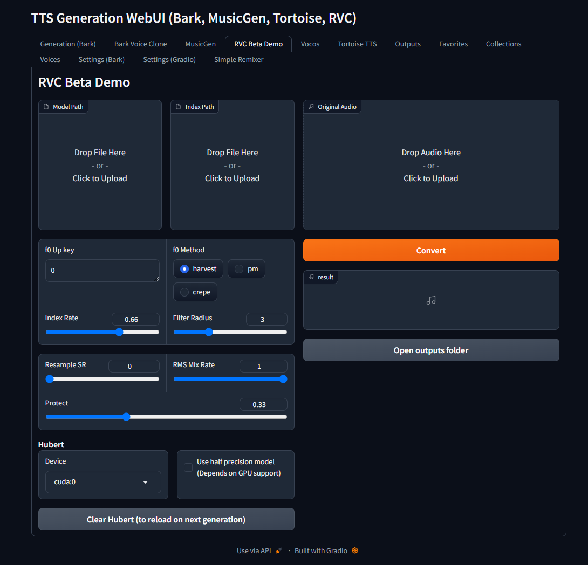
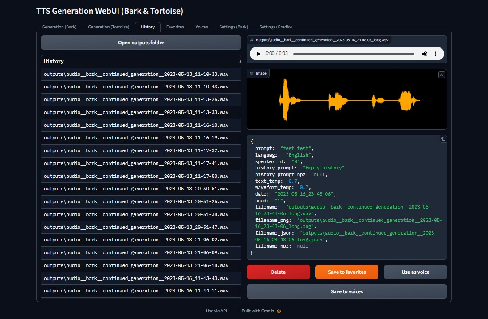

# TTS Generation WebUI (Bark, MusicGen, Tortoise, RVC, Vocos, Demucs)

## One click installers

[Download](https://github.com/rsxdalv/one-click-installers-tts/archive/refs/tags/v6.0.zip) ||
[Upgrading](#upgrading) ||
[Manual installation](#manual-installation)

## Videos

|                  **Refining Bark TTS vocals using Demucs & Vocos**                                                 |                  **Demo - How to use RVC with Tortoise**                                                 |                       **How To Get More Voices for Bark TTS**                                            |
| :------------------------------------------------------------------------------------------------------: | :------------------------------------------------------------------------------------------------------: | :------------------------------------------------------------------------------------------------------: |
|  |  |  |

## Screenshots

|             |         |  |
| :---------------------------------------------------: | :---------------------------------------------------: | :--------------------------------------: |
| .png>) | .png>) |  |

## Examples

[audio__bark__continued_generation__2023-05-04_16-07-49_long.webm](https://user-images.githubusercontent.com/6757283/236218842-b9dc253e-05de-49e5-ada9-e714e1e2cbd4.webm)

[audio__bark__continued_generation__2023-05-04_16-09-21_long.webm](https://user-images.githubusercontent.com/6757283/236219228-518d2b70-51a3-4175-af44-b24c01d14932.webm)

[audio__bark__continued_generation__2023-05-04_16-10-55_long.webm](https://user-images.githubusercontent.com/6757283/236219243-dad96404-0879-4274-828e-7f3afc6bac65.webm)

## Extra Voices
https://rsxdalv.github.io/bark-speaker-directory/

## Changelog
July 10:
* Demucs Demo https://github.com/rsxdalv/tts-generation-webui/pull/67

July 9:
* RVC Demo + Tortoise, v6 installer with update script and automatic attempts to install extra modules https://github.com/rsxdalv/tts-generation-webui/pull/66

July 5:
* Improved v5 installer - faster and more reliable https://github.com/rsxdalv/tts-generation-webui/pull/63

July 2:
* Upgrade bark settings https://github.com/rsxdalv/tts-generation-webui/pull/59

July 1:
* Studio-tab https://github.com/rsxdalv/tts-generation-webui/pull/58

Jun 29:
* Tortoise new params https://github.com/rsxdalv/tts-generation-webui/pull/54

Jun 27:
* Fix eager loading errors, refactor https://github.com/rsxdalv/tts-generation-webui/pull/50

Jun 20
* Tortoise: proper long form generation files https://github.com/rsxdalv/tts-generation-webui/pull/46

Jun 19
* Tortoise-upgrade https://github.com/rsxdalv/tts-generation-webui/pull/45

June 18:
* Update to newest audiocraft, add longer generations

Jun 14:
* add vocos wav tab https://github.com/rsxdalv/tts-generation-webui/pull/42

June 5:
* Fix "Save to Favorites" button on bark generation page, clean up console (v4.1.1)
* Add "Collections" tab for managing several different data sets and easier curration.

June 4:
* Update to v4.1 - improved hash function, code improvements

June 3:
* Update to v4 - new output structure, improved history view, codebase reorganization, improved metadata, output extensions support

May 21:
* Update to v3 - voice clone demo

May 17:
* Update to v2 - generate results as they appear, preview long prompt generations piece by piece, enable up to 9 outputs, UI tweaks

May 16:
* Add gradio settings tab, fix gradio errors in console, improve logging.
* Update History and Favorites with "use as voice" and "save voice" buttons
* Add voices tab
* Bark tab: Remove "or Use last generation as history"
* Improve code organization

May 13:
* Enable deterministic generation and enhance generated logs. Credits to https://github.com/suno-ai/bark/pull/175.

May 10:
* Enable the possibility of reusing history prompts from older generations. Save generations as npz files. Add a convenient method of reusing any of the last 3 generations for the next prompts. Add a button for saving and collecting history prompts under /voices. https://github.com/rsxdalv/tts-generation-webui/pull/10

May 4:
* Long form generation (credits to https://github.com/suno-ai/bark/blob/main/notebooks/long_form_generation.ipynb and https://github.com/suno-ai/bark/issues/161)
* Adapt to fixed env var bug

May 3:
* Improved Tortoise UI: Voice, Preset and CVVP settings as well as ability to generate 3 results (https://github.com/rsxdalv/tts-generation-webui/pull/6)

May 2 Update 2:
* Added support for history recylcing to continue longer prompts manually

May 2 Update 1:
* Added support for v2 prompts

Before:
* Added support for Tortoise TTS

## Upgrading
*In case of issues, feel free to contact the developers*.

### Upgrading from v5 to v6 installer
* Download and run the new installer
* Replace the "tts-generation-webui" directory in the newly installed directory
* Run update_*platform*

#### *Is there any more optimal way to do this?*

Not exactly, the dependencies clash, especially between conda and python (and dependencies are already in a critical state, moving them to conda is ways off). Therefore, while it might be possible to just replace the old installer with the new one and running the update, the problems are unpredictable and **unfixable**. Making an update to installer requires a lot of testing so it's not done lightly.

### Upgrading from v4 to v5 installer
* Download and run the new installer
* Replace the "tts-generation-webui" directory in the newly installed directory
* Run update_*platform*

## Manual installation (not recommended, check installer source for reference)

* Install conda or another virtual environment
* Highly recommended to use Python 3.10
* Install git (`conda install git`)
* Install ffmpeg (`conda install -y -c pytorch ffmpeg`)
* Set up pytorch with CUDA or CPU (https://pytorch.org/audio/stable/build.windows.html#install-pytorch)
* Clone the repo: `git clone https://github.com/rsxdalv/tts-generation-webui.git`
* install the root requirements.txt with `pip install -r requirements.txt`
* clone the repos in the ./models/ directory and install requirements under them
* run using `(venv) python server.py`

* Potentially needed to install build tools (without Visual Studio): https://visualstudio.microsoft.com/visual-cpp-build-tools/

## Open Source Libraries

This project utilizes the following open source libraries:

- **suno-ai/bark** - [MIT License](https://github.com/suno-ai/bark/blob/main/LICENSE)
  - Description: A powerful library for XYZ.
  - Repository: [suno/bark](https://github.com/suno-ai/bark)

- **tortoise-tts** - [Apache-2.0 License](https://github.com/neonbjb/tortoise-tts/blob/master/LICENSE)
  - Description: A flexible text-to-speech synthesis library for various platforms.
  - Repository: [neonbjb/tortoise-tts](https://github.com/neonbjb/tortoise-tts)

- **ffmpeg** - [LGPL License](https://github.com/FFmpeg/FFmpeg/blob/master/LICENSE.md)
  - Description: A complete and cross-platform solution for video and audio processing.
  - Repository: [FFmpeg](https://github.com/FFmpeg/FFmpeg)
  - Use: Encoding Vorbis Ogg files

- **ffmpeg-python** - [Apache 2.0 License](https://github.com/kkroening/ffmpeg-python/blob/master/LICENSE)
  - Description: Python bindings for FFmpeg library for handling multimedia files.
  - Repository: [kkroening/ffmpeg-python](https://github.com/kkroening/ffmpeg-python)

- **audiocraft** - [MIT License](https://github.com/facebookresearch/audiocraft/blob/main/LICENSE)
  - Description: A library for audio generation and MusicGen.
  - Repository: [facebookresearch/audiocraft](https://github.com/facebookresearch/audiocraft)

- **vocos** - [MIT License](https://github.com/charactr-platform/vocos/blob/master/LICENSE)
  - Description: An improved decoder for encodec samples
  - Repository: [charactr-platform/vocos](https://github.com/charactr-platform/vocos)

- **RVC** - [MIT License](https://github.com/RVC-Project/Retrieval-based-Voice-Conversion-WebUI/blob/main/LICENSE)
  - Description: An easy-to-use Voice Conversion framework based on VITS.
  - Repository: [RVC-Project/Retrieval-based-Voice-Conversion-WebUI](https://github.com/RVC-Project/Retrieval-based-Voice-Conversion-WebUI)

## Ethical and Responsible Use
This technology is intended for enablement and creativity, not for harm.

By engaging with this AI model, you acknowledge and agree to abide by these guidelines, employing the AI model in a responsible, ethical, and legal manner.
- Non-Malicious Intent: Do not use this AI model for malicious, harmful, or unlawful activities. It should only be used for lawful and ethical purposes that promote positive engagement, knowledge sharing, and constructive conversations.
- No Impersonation: Do not use this AI model to impersonate or misrepresent yourself as someone else, including individuals, organizations, or entities. It should not be used to deceive, defraud, or manipulate others.
- No Fraudulent Activities: This AI model must not be used for fraudulent purposes, such as financial scams, phishing attempts, or any form of deceitful practices aimed at acquiring sensitive information, monetary gain, or unauthorized access to systems.
- Legal Compliance: Ensure that your use of this AI model complies with applicable laws, regulations, and policies regarding AI usage, data protection, privacy, intellectual property, and any other relevant legal obligations in your jurisdiction.
- Acknowledgement: By engaging with this AI model, you acknowledge and agree to abide by these guidelines, using the AI model in a responsible, ethical, and legal manner.

## License

### Codebase and Dependencies

The codebase is licensed under MIT. However, it's important to note that when installing the dependencies, you will also be subject to their respective licenses. Although most of these licenses are permissive, there may be some that are not. Therefore, it's essential to understand that the permissive license only applies to the codebase itself, not the entire project.

That being said, the goal is to maintain MIT compatibility throughout the project. If you come across a dependency that is not compatible with the MIT license, please feel free to open an issue and bring it to our attention.

Known non-permissive dependencies:
| Library     | License           | Notes                                                                                     |
|-------------|-------------------|-------------------------------------------------------------------------------------------|
| encodec     | CC BY-NC 4.0      | Newer versions are MIT, but need to be installed manually                                  |
| diffq       | CC BY-NC 4.0      | Optional in the future, not necessary to run, can be uninstalled, should be updated with demucs |
| lameenc     | GPL License       | Future versions will make it LGPL, but need to be installed manually                      |
| unidecode   | GPL License       | Not mission critical, can be replaced with another library, issue: https://github.com/neonbjb/tortoise-tts/issues/494 |

### Model Weights
Model weights have different licenses, please pay attention to the license of the model you are using.

Most notably:
- Bark: CC BY-NC 4.0 (MIT According to repo, but CC BY-NC 4.0 according to HuggingFace)
- Tortoise: *Unknown* (Apache-2.0 according to repo, but no license file in HuggingFace)
- MusicGen: CC BY-NC 4.0
